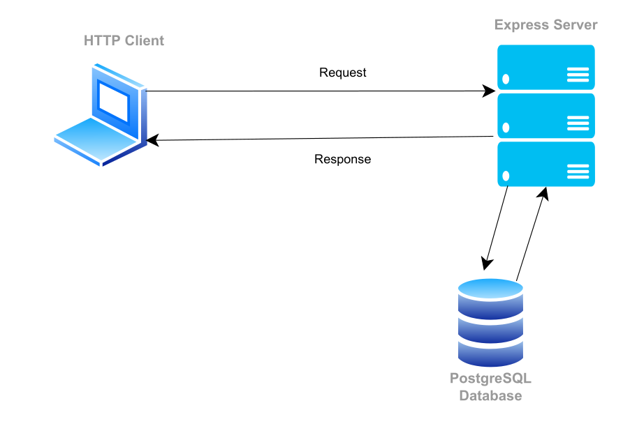

# Birthday party management

## Description

Simple REST API for birthday party management.

## Table of contents

- [Techstack](#techstack)
- [Requirements](#requirements)
- [To run app](#to-run-app)
  - [Clone repository](#clone-repository)
  - [Navigate to project folder](#navigate-to-project-folder)
  - [Install dependencies](#install-dependencies)
  - [Run API](#run-api)
  - [Env setup](#env-setup)
  - [Setup database](#setup-database)
  - [Setup Postman environment](#setup-postman-environment)
- [Application architecture](#application-architecture)
- [Database architecture](#database-architecture)
- [Endpoints](#endpoints)

## Techstack

- `JavaScript`
- `Express`
- `PostgreSQL`

## Requirements

- install `node`
- install `postgresql`

## To run app

### Clone repository

```
git clone https://github.com/wojciechszmelczerczyk/express-manage-birthday-app
```

### Navigate to project folder

```
cd /express-manage-birthday-app
```

### Install dependencies

```
npm i
```

### Run API

```
npm run dev
```

### Env setup

Create `.env` file and setup variables.

```dockerfile
# server port number
PORT=

# db user
DB_USER=

# db password
DB_PASSWORD=

# db name
DB_NAME=

# db host
DB_HOST=

# db port
DB_PORT=

# jwt expiration time in milliseconds
JWT_EXPIRATION_TIME=

# jwt secret string
JWT_SECRET=

# date yyyy:mm:dd hh:mm:ss format
BIRTHDAY_DATE=yyyy:mm:dd hh:mm:ss

# string data
BIRTHDAY_PLACE=

# name for invitation file
FILE_NAME=invitation.txt
```

### Setup database

Login to postgresql as superuser.

In order to setup database run following script:

```sql
CREATE DATABASE birthday_party
    WITH
    OWNER = postgres
    ENCODING = 'UTF8'
    LC_COLLATE = 'en_US.UTF-8'
    LC_CTYPE = 'en_US.UTF-8'
    TABLESPACE = pg_default
    CONNECTION LIMIT = -1;
```

#### Create table

```sql
CREATE TABLE guest (
	guest_id serial PRIMARY KEY,
	name VARCHAR ( 50 )  NOT NULL,
	surname VARCHAR ( 50 ) NOT NULL,
	uuid VARCHAR ( 50 )  NOT NULL,
  "isOwner" BOOLEAN DEFAULT FALSE,
  status VARCHAR ( 50 )  DEFAULT NULL,
	modified_status TIMESTAMP DEFAULT NULL

);
```

#### Change in database one of the user isOwner field to true in order to use admin endpoints.

```sql
UPDATE guest
SET "isOwner" = true
WHERE guest_id = 1;
```

### Setup Postman environment

Import file included in project.

## Application Architecture

<details>
<summary>Application implements REST API architecture style</summary>


</details>

## Database Architecture

<details>
<summary>Guest entity</summary>

[](https://mermaid.live/edit/#pako:eNptUM0KgzAMfpWSs0_Q88aOO7hjYWQ2ujDbSpsyhvjuq1MPDnNJvj9IMkITLIGGpseUToxdRGe8KvVj1CVTkhmqhV2wVrVE9p3y6OhQSDn-aVo9QugJveJ0fXuKO22N5cz2iE-CktNOubErHd2gXLDcMtn75oIKHEWHbMtl45wyIE8q64Auo8X4MmD8VHx5sCh0tiwhgm6xT1QBZgn1xzegJWbaTOt3Vtf0BUnaapk)

</details>

## Endpoints

| Method |                           Endpoint                            |
| :----: | :-----------------------------------------------------------: |
|  POST  |         [`/guest/register`](./docs/guest/register.md)         |
|  POST  |            [`/guest/auth`](./docs/guest/login.md)             |
| DELETE |           [`/guest/logout`](./docs/guest/delete.md)           |
|  PUT   |         [`/guest/change-status`](./docs/guest/put.md)         |
|  GET   |      [`/guest/download-invitation`](./docs/guest/get.md)      |
|  GET   |    [`/owner/list/accepted`](./docs/owner/list-accepted.md)    |
|  GET   | [`/owner/list/no-feedback`](./docs/owner/list-no-feedback.md) |
|  GET   |      [`/owner/list/denied`](./docs/owner/list-denied.md)      |
